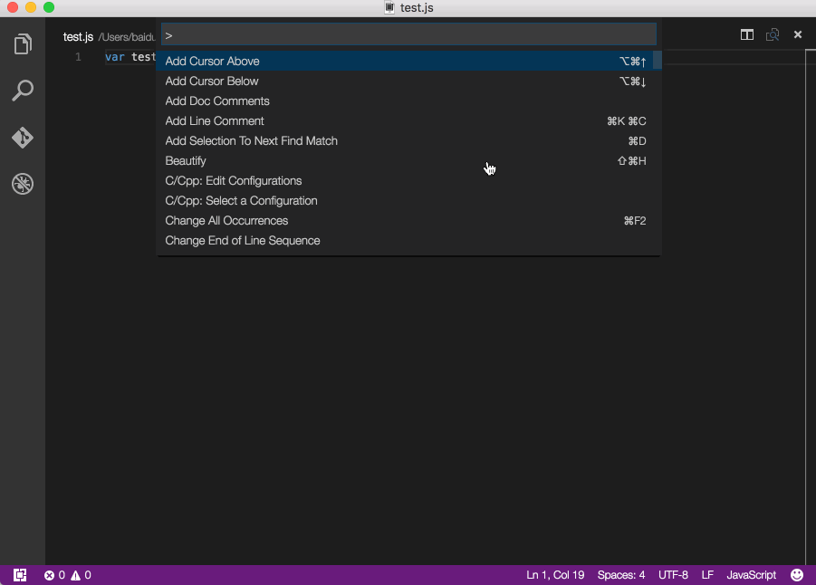

# vscode fecs插件
Fecs extension for vscode

# feature
 - 支持中英文切换，默认中文
 - 支持保存时自动使用fecs检查，默认不开启
 - 支持配置检查级别，可配置为只检查error或warn，或者同时检查，默认同时检查
 
# install
## 1. 安装 [fecs](http://fecs.baidu.com/)
```
sudo npm install fecs -g
```
## 2. 安装插件 [fecs extension for vscode](https://marketplace.visualstudio.com/items?itemName=Marx.fecs&showReviewDialog=true)
在vscode里按 ```cmd + p```，输入：
```
ext install fecs
```

# configuration

按```cmd + ,```打开用户配置，若使用默认配置则不用修改

```javascript
{
    // 配置是否使用英文显示，{boolean}
    // 默认false，使用中文。设置为true，则使用英文
    "fecs.en": false,

    // 配置是否在保存文件时自动使用fecs，{boolean}
    // 本着不扰民的思想，默认false，不自动使用。设置为true，则在保存时自动使用fecs
    "fecs.auto": false

    // 配置fecs的check level，{number}
    // 0为显示error和warn，1为只显示warn，2为只显示error，默认level为0
    "fecs.level": 0,
}
```
# use 

## 快捷键
```cmd + shift + r```

## 命令操作
在打开的javascript、HTML、CSS等fecs支持的文件下

按 ```cmd + shift + p```

输入
```
fecs
```
之后就能看见fecs输出的结果，用output输出比较方便多条信息查看，下面是演示




# BUGS

- 自动保存功能需要手动触发一次才能使用 [#8](https://github.com/MarxJiao/VScode-fecs/issues/8)
- 如果windows下有使用问题，欢迎在这里讨论[#9](https://github.com/MarxJiao/VScode-fecs/issues/9)

# DEVELOPMENT

```shell
npm install
```
```shell
npm run compile
```
之后点击debug按钮，就会开启一个已经安装好正在开发的插件的窗口。